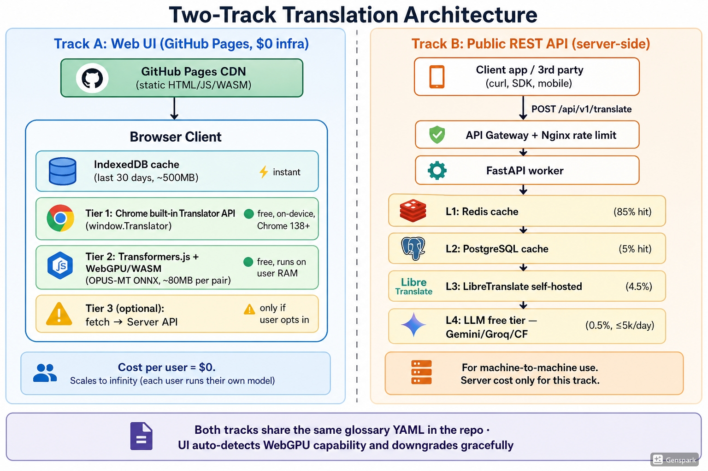

# Zero-Cost Translate

> **Web UI はクライアントRAMで翻訳（GitHub Pages）／API はサーバー側で提供**



## 何が変わったか（v1 → v2）

| | v1 | v2 |
|---|---|---|
| Web UI | サーバー必須（Nginx + FastAPI 経由） | **GitHub Pages 静的、ブラウザだけで完結** |
| 翻訳実行 | サーバー側のRedis/PG/LibreTranslate | **ユーザーのRAM/CPU/GPU** |
| API | UIと同居 | **独立した別トラック**（必要な人だけ使う） |
| ユーザー1人増えるコスト | サーバー負荷 +1 | **ほぼ 0**（自分のブラウザで翻訳するため） |
| プライバシー | サーバーに送信 | **デフォルトで完全オンデバイス** |
| スケール上限 | サーバー性能 | **GitHub Pages の帯域だけ**（HTML 200KB/人） |

---

ローカル確認:
```bash
cd src && python3 -m http.server 8080
# → http://localhost:8080
```

## ライセンス
MIT
